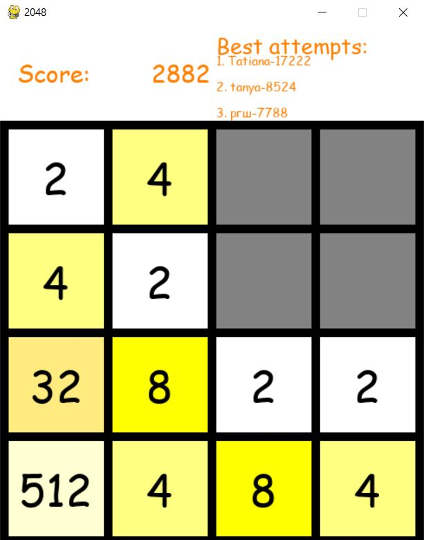

# 2048_game
## Game overview
2048 is a famous game clone made for fun and self-education.
Use arrows to join the tiles to get 2048 number (or more!). 

## Screenshot

## Launch
This game does not require any installation.
Launch using your IDE ('game.py') or using launcher 'game.exe' ('output' folder)

Scores are stored in sqlite, 3 best scores are shown in game window.

## License
2048 is licensed under the MIT license.
